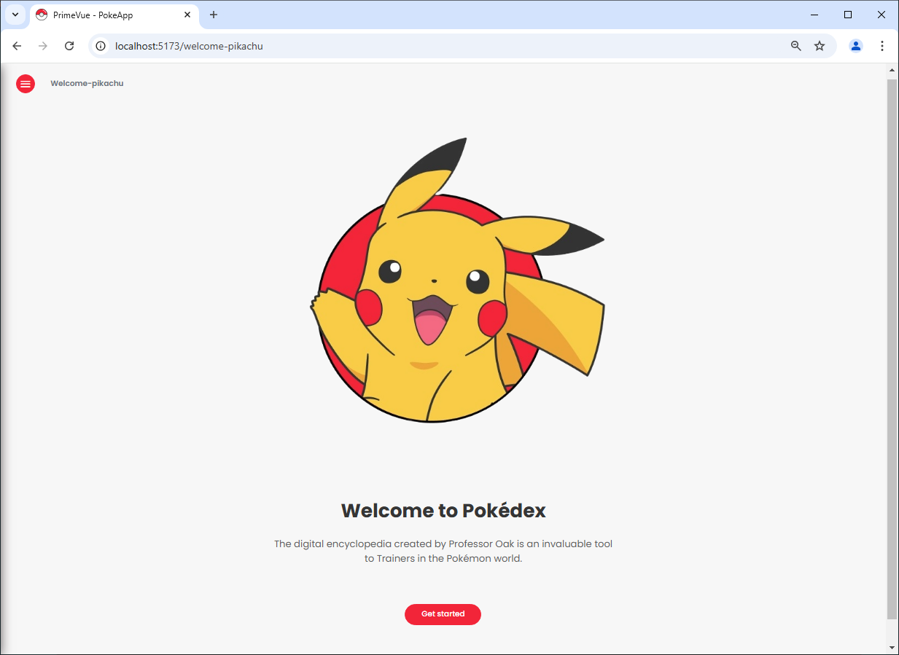
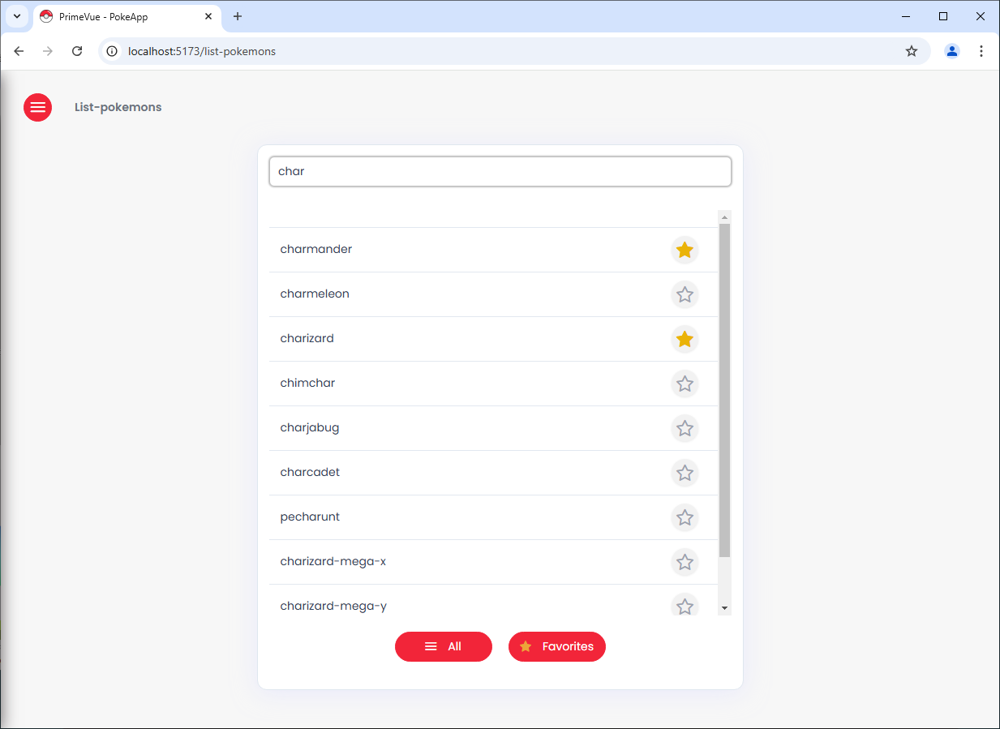

# Proyecto Poke-App

Este proyecto es una Poke-App interactiva construida con Vue 3. Se utiliza PrimeVue para componentes UI predefinidos como tarjetas, botones y paginadores, lo que mejora tanto la eficiencia como la estética de la aplicación. Además, se emplea Pinia para el manejo del estado global y SCSS para los estilos.

&nbsp;

### Tecnologías

- **Vue 3**: Framework principal para la aplicación.
- **Pinia**: Manejo del estado global.
- **PrimeVue**: Componentes UI reutilizables y fáciles de integrar, lo que optimiza el desarrollo y mejora la experiencia de usuario.
- **SCSS**: Estilos modulares y reutilizables.
- **Vite**: Bundler para optimizar el desarrollo.
- **Vue Router**: Gestión de rutas.
- **Vitest**: Framework para realizar pruebas unitarias, compatible con Vue 3.
- **Vue Test Utils**: Librería para facilitar las pruebas de los componentes Vue.
- **JSDom**: Simulación de un entorno de navegador para pruebas unitarias.

### Características:
- Paginación de Pokémon: Carga de Pokémon en bloques para evitar sobrecargar la vista.
- UI Reutilizable: Uso de componentes de PrimeVue para mejorar la interfaz y la estructura del código.

&nbsp;

### Capturas de Pantalla

| Inicio                                          | Listado de Pokemons                             |
|-------------------------------------------------|-------------------------------------------------|
|   |   |

&nbsp;

### Historial de Versiones

v1.0 (2025.02.25) - Versión inicial.

&nbsp;

Este código fuente se ofrece bajo la licencia GPL v3.0 (open source).  
Por favor envíame tu feedback a: ailinbaudin@gmail.com

&nbsp;

### Conéctate conmigo

Puedes encontrarme en [LinkedIn](https://www.linkedin.com/in/frontdeveloper-ailinbaudin/) para más información y proyectos.
